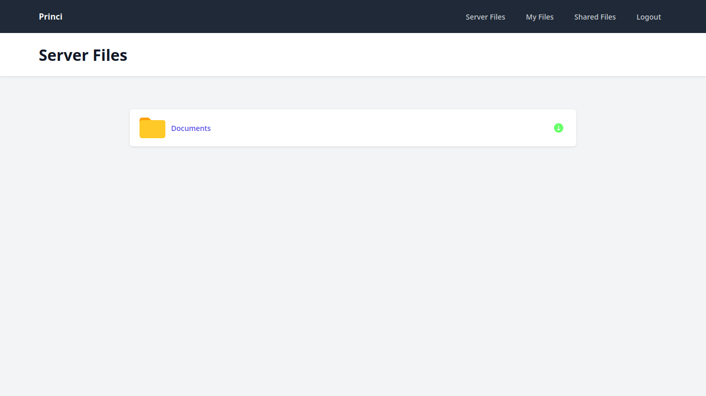

# LocalShare

LocalShare is a web-based file-sharing application designed for local networks, providing a simple interface to exchange files between users. LocalShare allows users to upload, store, and share files on a centralized server. Administrators have advanced permissions to share specific directories and files from the server's file system, streamlining resource management across the network.

## Features

- **User creation and management**
- **File sharing**: Upload and share files with other users connected to the local network.
- **Delete shared files**
- **Centralized storage**: Files are stored directly on the server, enabling quick access and centralized resource management.
- **Advanced administrative permissions**: Administrators can share specific folders and files from the server's file system, controlling access to network resources.

## Screenshots

- **Login Screen**  
  

- **User Registration Page**  
  

- **Add, share, and delete files**
  

- **Files shared by other users**
  

- **Files on the server file system**
  
  

## Technologies Used

- **Front-end**: TailwindCSS, Alpine.js
- **Back-end**: Python, Django
- **Database**: SQLite3

## Contributors

Contributions and suggestions for improvement are welcome! Feel free to open an issue or submit a pull request to propose your ideas.
